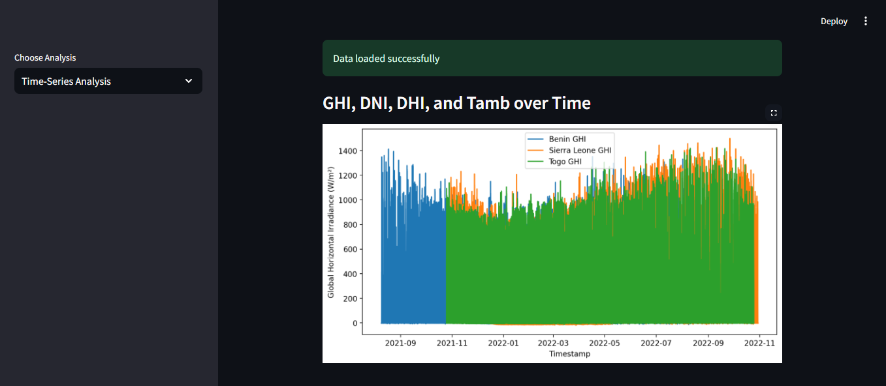
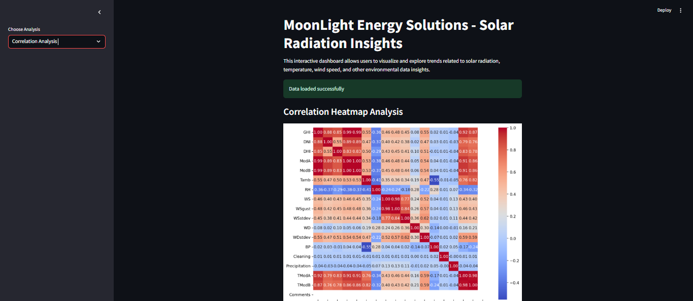
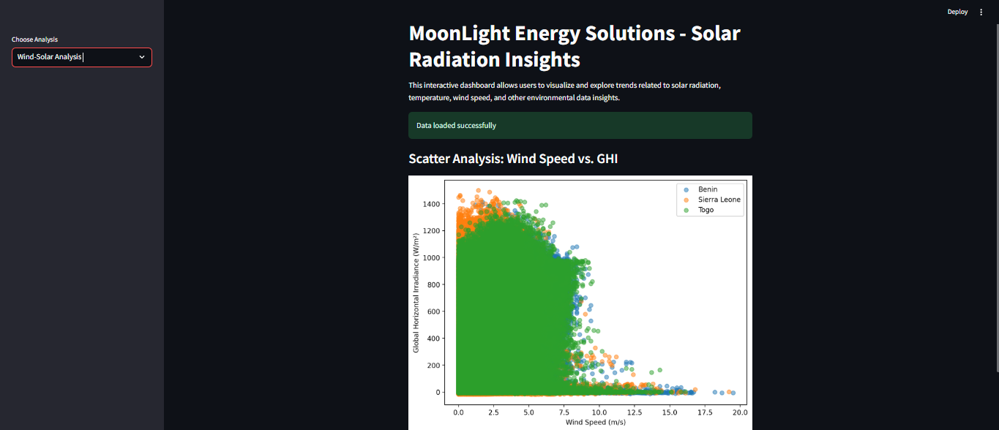
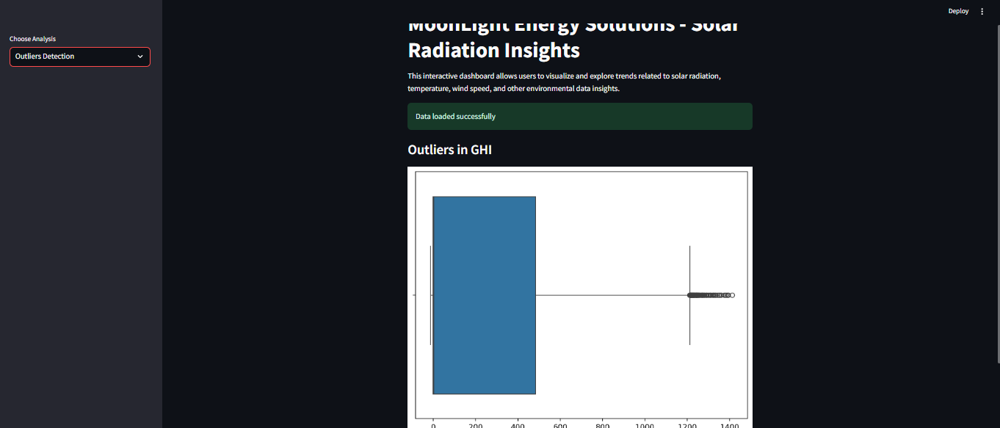

# 🌞 MoonLight Energy Solutions: Solar Radiation Insights Dashboard

## 📋 **Project Overview**

Welcome to the **MoonLight Energy Solutions Solar Radiation Insights Dashboard**! This dashboard is designed to help visualize key insights related to solar radiation, wind speed, temperature, and other environmental factors to support decision-making for solar investments.

The goal of this project is to:
- Analyze solar radiation measurement data across regions (Benin, Sierra Leone, and Togo).
- Identify key trends, patterns, and outliers using statistical analysis and visualization.
- Visualize the relationship between wind conditions, temperature, and solar radiation using **Streamlit**.

---

## 🏆 **Features**

1. **Exploratory Data Analysis (EDA)**:
   - Visualize trends in **Global Horizontal Irradiance (GHI)**, **Direct Normal Irradiance (DNI)**, and **Diffuse Horizontal Irradiance (DHI)** over time.
   - Perform **outliers detection** to identify anomalies in the GHI data.
   - Understand correlations among environmental variables like GHI, wind speed, humidity, and temperature.

2. **Interactive Streamlit Dashboard**:
   - A user-friendly, interactive dashboard with visualizations to explore data insights dynamically.
   - Features include:
     - Correlation heatmaps.
     - Time-series analysis.
     - Wind and solar speed analysis.
     - Outliers detection visualization.

---

## 📊 **Screenshots**

### **1. Time-Series Analysis**
Visualize trends of GHI, DNI, DHI, and Tamb over time.


---

### **2. Correlation Heatmap Analysis**
View correlations between solar radiation, wind speed, and environmental factors.


---

### **3. Wind-Solar Analysis**
Explore the relationship between wind speed and GHI values dynamically.


---

### **4. Outliers Detection**
Identify anomalies in GHI values using statistical visualization.


---

## ⚙️ **Setup Instructions**

To set up this project locally and run the dashboard:

---

### **1. Clone the Repository**
Clone this repository to your local machine:
```bash
git clone https://github.com/<your-github-username>/10-Academy.git
